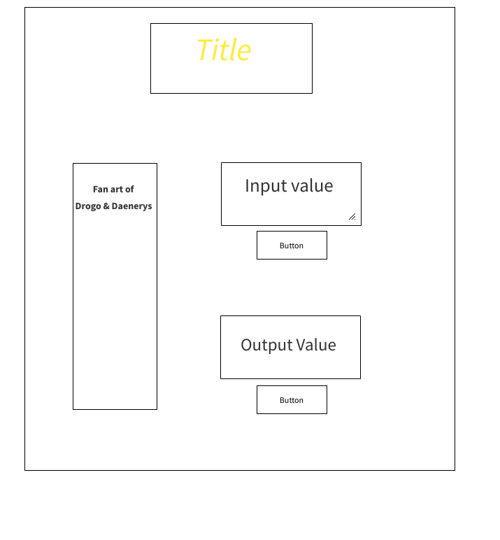
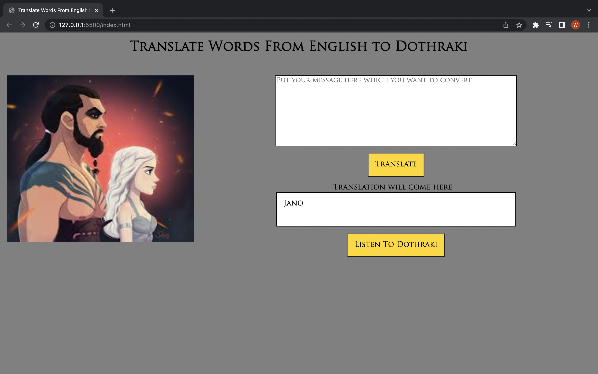

# Translate Words from English to Dothraki

## A simple web application that translate English words in to Dothraki. This is possible due to an API created by fun translations

# Technologies Used
 ## . CSS
 ## . HTML
 ## . Java Script
 ## . jQuery
 ## . Google Fonts
 ## . Fun Translation API 
 ## . Fan Art I Found On Google 
 ## . inVisionapp To Make My Wire Frame 

# Screenshot of Wire Frame 
 

# Screenshot of Desktop
[Website Screenshot](https://github.com/[username]/[reponame]/blob/[branch]/image.jpg?raw=true) 

# Getting Started